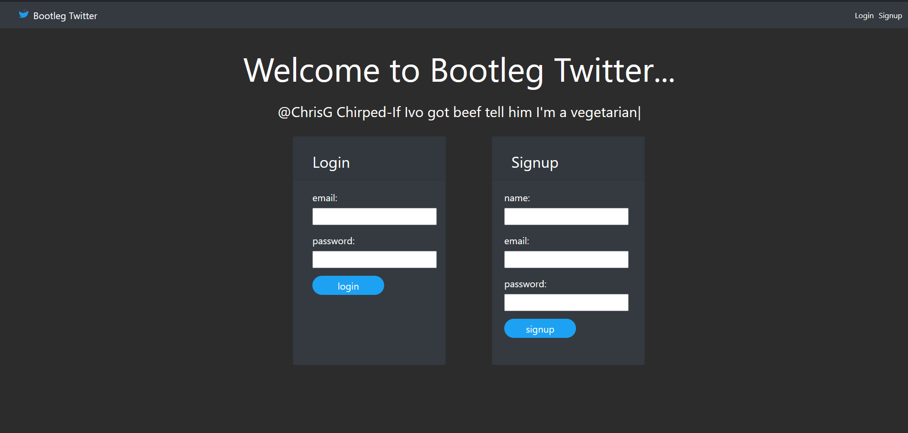
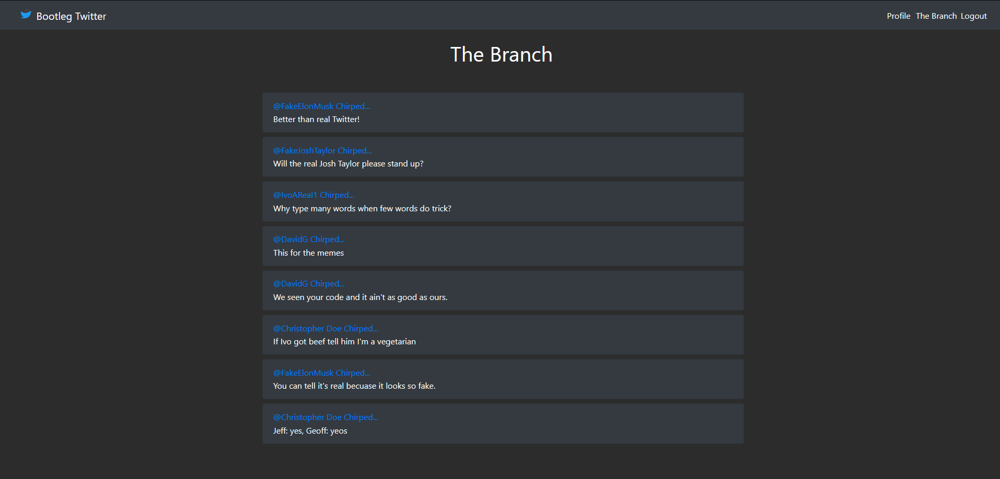
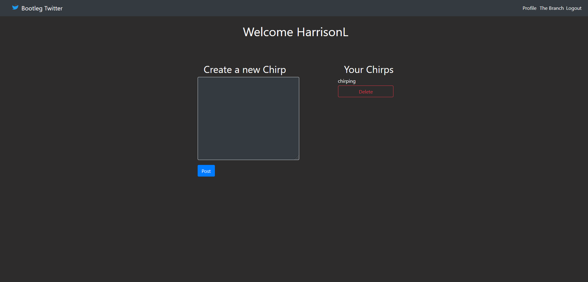

# Bootleg Twitter

## Description

A simple Twitter clone that allows users to post chirps, and view chirps from other users. This app uses authentication to allow users to create an account, and login to their account. This app also uses a database to store chirps and user information.

[View deployed HEROKU app here:](https://bootleg-twitter.herokuapp.com/)

## Table of Contents

* [Installation](#installation)
* [Usage](#usage)
* [Credits](#credits)
* [License](#license)

## Technologies Used

This app uses the following technologies:

* Node.js
* Express.js
* MySQL
* Sequelize
* Handlebars.js

## Installation

Bootleg Twitter is installed by cloning the repository from GitHub. Once the repository is cloned, you can run the app by running the `node server` command in the terminal. The app will be running on `localhost:3000`.

## Usage

This app is used to share your thoughts with the world. You can create an account, and then post chirps. You can also view chirps from other users.

## Credits

Lamm9, DavidDontKnow, UserHAL-9000, Jazinha, and Christgom113

## License

MIT License